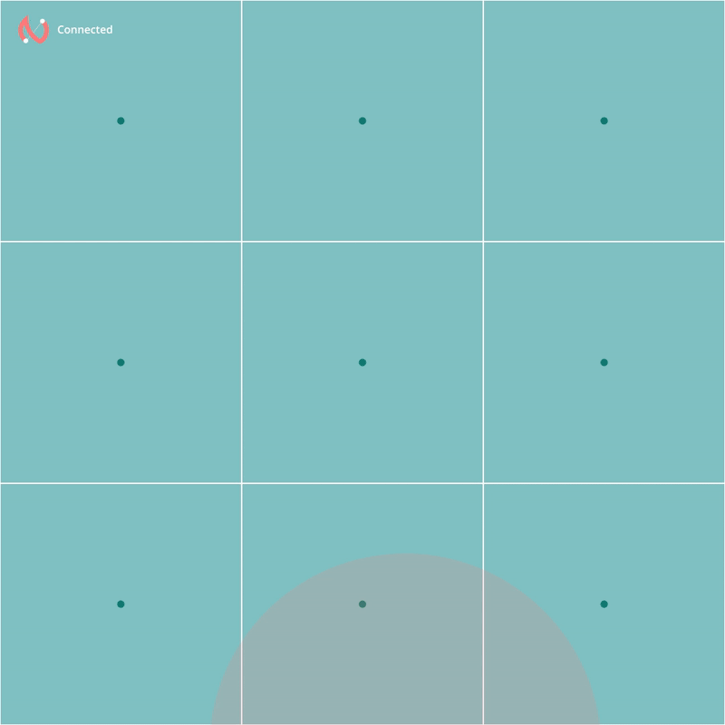

# Nearest

Web application for chatting with people around based on location



## Getting Started

These instructions will get you a copy of the project up and running on your local machine for development and testing purposes.

### Prerequisites

In order to run this project you'll need docker & docker compose installed.


### Installation


```
docker-compose up --build
```